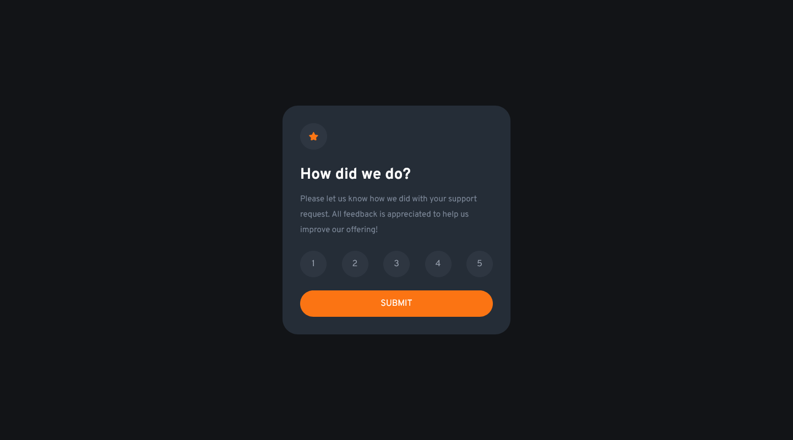

# Frontend Mentor - Interactive rating component solution

This is a solution to the [Interactive rating component challenge on Frontend Mentor](https://www.frontendmentor.io/challenges/interactive-rating-component-koxpeBUmI). Frontend Mentor challenges help you improve your coding skills by building realistic projects.

## Table of contents

-   [Overview](#overview)
    -   [The challenge](#the-challenge)
    -   [Screenshot](#screenshot)
-   [My process](#my-process)
    -   [Built with](#built-with)
    -   [What I learned](#what-i-learned)
    -   [Continued development](#continued-development)
    -   [Useful resources](#useful-resources)
-   [Author](#author)

## Overview

### The challenge

Users should be able to:

-   View the optimal layout for the app depending on their device's screen size
-   See hover states for all interactive elements on the page
-   Select and submit a number rating
-   See the "Thank you" card state after submitting a rating

### Screenshot

## My process

### Built with

-   HTML5
-   Tailwind CSS
-   [JQuery](https://jquery.com/) - JS library
-   Mobile-first workflow

### What I learned

First TailwindCSS & JQuery project. I learned basic usage of Tailwind and JQuery

### Useful resources

-   [Tailwind CSS Docs](https://tailwindcss.com/docs/installation)
-   [Jquery Tutorial](https://www.example.com) - I'd recommend it to anyone to learn basic JQuery.
    Note: Delete this note and replace the list above with resources that helped you during the challenge. These could come in handy for anyone viewing your solution or for yourself when you look back on this project in the future.\*\*

## Author

-   Website - [yusufs](https://yusufs.w3spaces.com/)
-   Frontend Mentor - [@yusfsqrtof](https://www.frontendmentor.io/profile/yusfsqrtof)
